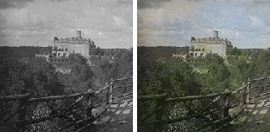
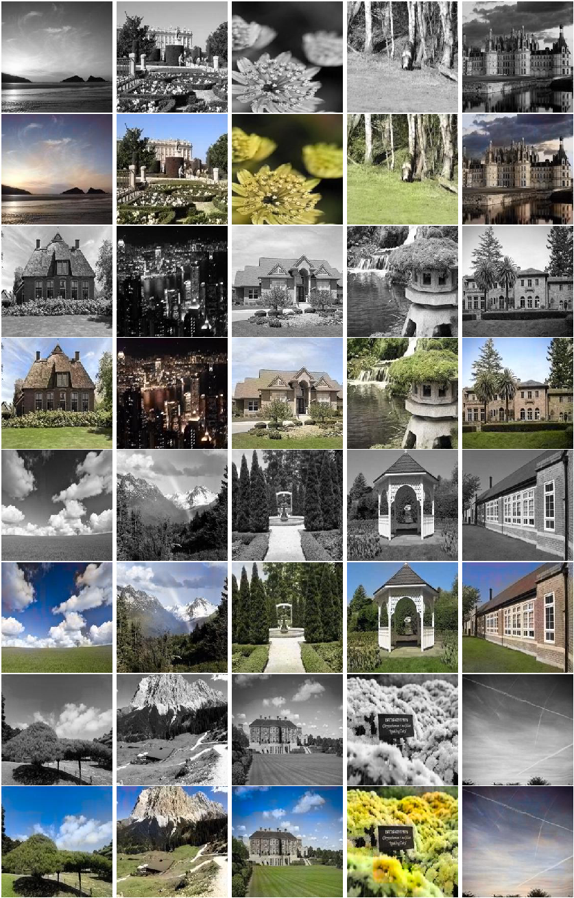
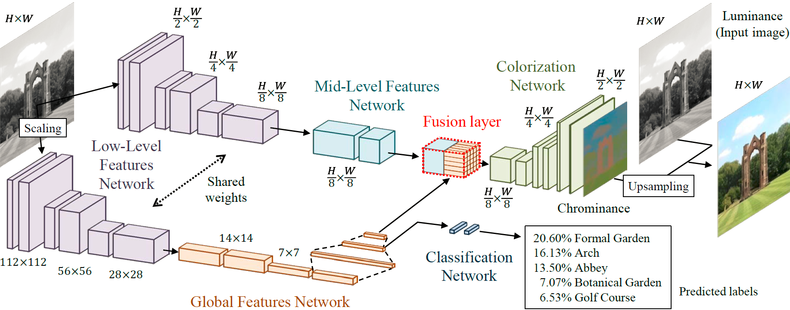

# 🖌️ Colorify - Black and White Images
Implementation of [_Let there be Color!_](http://iizuka.cs.tsukuba.ac.jp/projects/colorization/en/)
by Satoshi Iizuka, Edgar Simo-Serra and Hiroshi Ishikawa, as L4T2 Machine Learning Project.

_Colorized 100 years old photo of Książ Castle:_



[More images](colorized/colorized.md)

_Other colorized images:_



## Model Architecture


### 📄 Dataset Used
[Places365-Standard](http://places2.csail.mit.edu/download-private.html) 

### 🗃️ Requirements
Code is written in Python 3.11. [Here](requirements.txt) are all requirements, hit the following to install:
```bash
pip3 install -r requirements.txt
```

### 🧑‍💻 Contributors
1. [Sourov Jajodia](https://github.com/Sourov72)
2. [Shafayat Hossain Majumder](https://github.com/MrMajumder)
